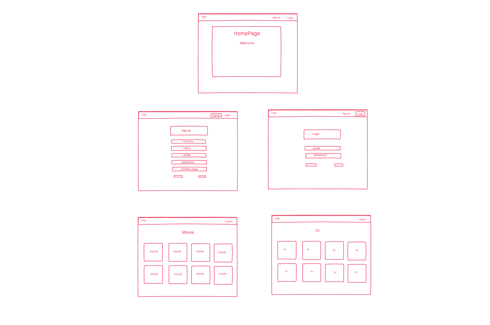
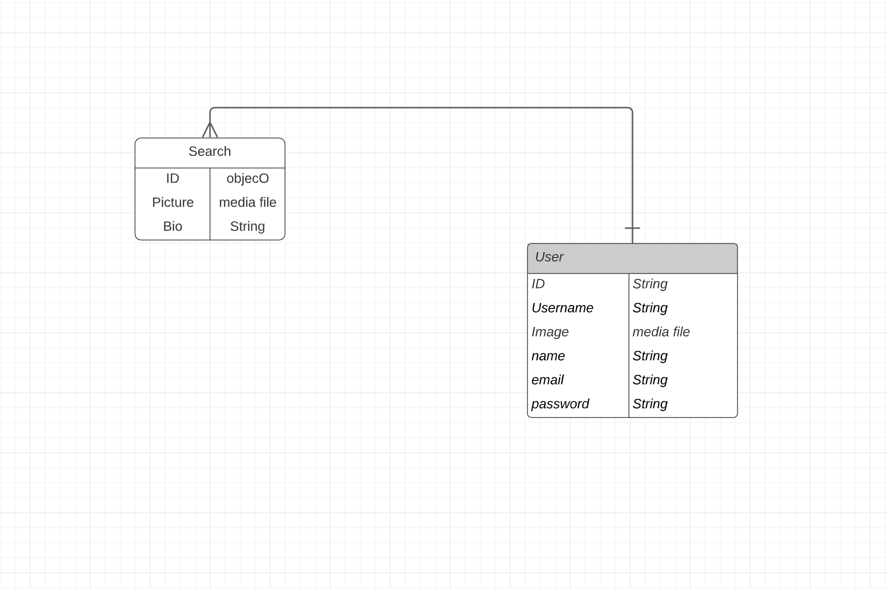
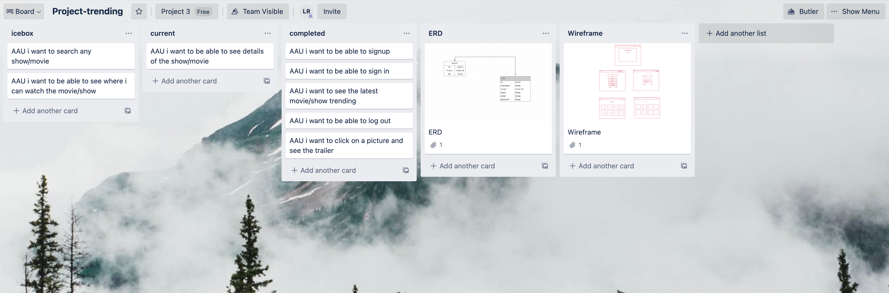

# #Trending

A web application where the user can see the latest trending movies & tv shows

## Technologies Used
- React.js
- Jquery
- HTML 5
- CSS3
- JavaScript
- Node.js
- Express
- Bootsrap
- Movie API
- Mongoose/MongoDB
- Trello Board
- Wireframe
- Invisionapp
- Heroku
- Google Fonts

## Screenshots

## Getting started

[Click here](https://project-trending.netlify.app/) to see the deployed app!

## Explanation
 - used React.js to make a SPA. in order to make the app more response without refresing. used components to structure and style the entire page. 

 - used Express.js, mongoDB and mongoose to set up my database. users are able to register and save their information in the DB. passwords are encrypted and Salted.

## Approach
-I use the trello board to design the approach a user would take once inside the app. I was able to design it with a wireframe. With those two ready I was able to move forward with my React.js and Express.js to input my functionalities. following the wireframe design i was able to stylized my page according to how i planned.

## Future Enhancements

- user profile page
- enable the user to post reviews for each show/movie
- enable more details once the picture is clicked.
- enable user to save a movie/show as favorite.
